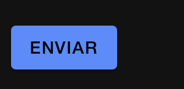
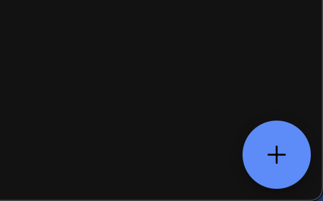
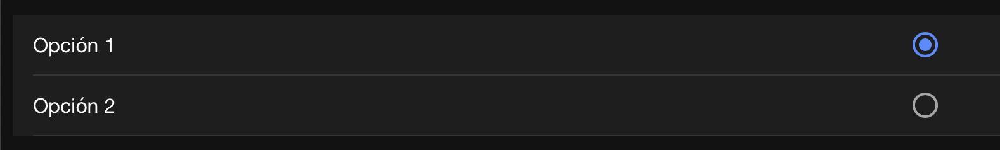
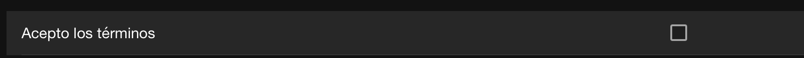
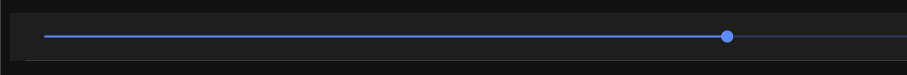
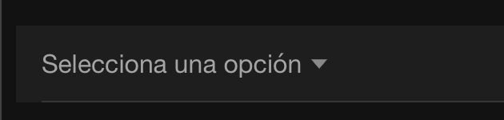
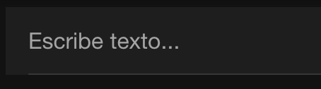
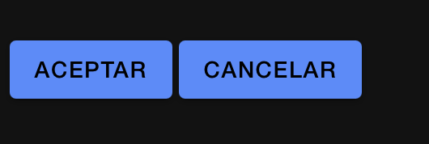
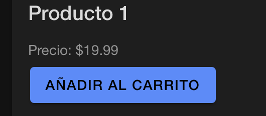
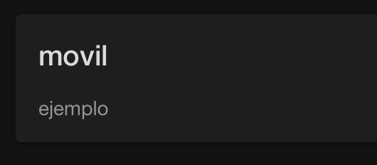

# ENLACE VIDEO EXPLICATIVO
https://drive.google.com/file/d/1pOqK-u-feZMYOVCu8ZoCl2o_vpsqEkWE/view?usp=sharing 

# COMPONENTES INDIVIDUALES

## COMPONENTE ButtonComponent
Este componente en React usa el componente IonButton de Ionic para crear un botón que muestra el texto “Enviar”. Al hacer clic, ejecuta la función handleClick, que dispara una alerta en pantalla con el mensaje “Botón presionado”.

### TYPESCRIP
import React from 'react';
import { IonButton } from '@ionic/react';

function ButtonComponent() {
  const handleClick = () => {
    alert('Botón presionado');
  };

  return <IonButton onClick={handleClick}>Enviar</IonButton>;
}
export default ButtonComponent;

### Evidencia

## COMPONENTE FloatingActionButton
Este en React usa el componente IonButton de Ionic para crear un botón que muestra el texto “Enviar”. Al hacer clic, ejecuta la función handleClick, que dispara una alerta en pantalla con el mensaje “Botón presionado”.

### TYPESCRIP
import React from 'react';
import { IonFab, IonFabButton, IonIcon } from '@ionic/react';
import { add } from 'ionicons/icons';

interface FloatingActionButtonProps {
  onClick: () => void;
}

const FloatingActionButton: React.FC<FloatingActionButtonProps> = ({ onClick }) => {
  return (
    <IonFab vertical="bottom" horizontal="end" slot="fixed">
      <IonFabButton onClick={onClick}>
        <IonIcon icon={add} />
      </IonFabButton>
    </IonFab>
  );
};
export default FloatingActionButton;

### Evidencia

## COMPONENTE RadioInput
Este componente  en React utiliza IonRadioGroup y IonRadio de Ionic para crear un grupo de opciones seleccionables. Usa un estado selectedOption que inicialmente está en “option1”. Al seleccionar una opción, onIonChange actualiza el valor seleccionado, reflejando el cambio en la interfaz. Cada IonItem contiene un IonLabel y un IonRadio para mostrar las opciones “Opción 1” y “Opción 2”.
### TYPESCRIP
import React, { useState } from 'react';
import { IonRadio, IonRadioGroup, IonItem, IonLabel } from '@ionic/react';

function RadioInput() {
  const [selectedOption, setSelectedOption] = useState('option1');

  return (
    <IonRadioGroup value={selectedOption} onIonChange={(e) => setSelectedOption(e.detail.value)}>
      <IonItem>
        <IonLabel>Opción 1</IonLabel>
        <IonRadio value="option1" />
      </IonItem>
      <IonItem>
        <IonLabel>Opción 2</IonLabel>
        <IonRadio value="option2" />
      </IonItem>
    </IonRadioGroup>
  );
}
export default RadioInput;

### Evidencia

## COMPONENTE CheckboxInput
Este componente  en React utiliza IonCheckbox de Ionic para crear una casilla de verificación con la etiqueta “Acepto los términos”. El estado isChecked, inicializado en false, controla si la casilla está marcada. Al cambiar el estado de la casilla, onIonChange actualiza isChecked para reflejar la selección del usuario.
### TYPESCRIP
import React, { useState } from 'react';
import { IonCheckbox, IonItem, IonLabel } from '@ionic/react';

function CheckboxInput() {
  const [isChecked, setIsChecked] = useState(false);

  return (
    <IonItem>
      <IonLabel>Acepto los términos</IonLabel>
      <IonCheckbox
        checked={isChecked}
        onIonChange={(e) => setIsChecked(e.detail.checked)}
      />
    </IonItem>
  );
}

export default CheckboxInput;

### Evidencia

## COMPONENTE DateInput
Este componente  en React utiliza IonInput de Ionic para crear un campo de entrada de fecha. El estado date, inicializado como una cadena vacía, mantiene el valor de la fecha seleccionada. El usuario puede seleccionar una fecha en el IonInput, que está configurado con el atributo type="date".

### TYPESCRIP
import React, { useState } from 'react';
import { IonItem, IonInput } from '@ionic/react';

function DateInput() {
  const [date, setDate] = useState('');

  return (
    <IonItem>
      <IonInput
        type="date"
        value={date}
      />
    </IonItem>
  );
}

export default DateInput;

### Evidencia
 {
  const [value, setValue] = useState(50);

  return (
    <IonItem>
      <IonRange
        value={value}
      />
    </IonItem>
  );
}

export default RangeSlider;

### Evidencia

## COMPONENTE SelectInput
Este componente  en React utiliza IonInput de Ionic para crear un campo de entrada de texto. El estado text, inicialmente vacío, almacena el valor ingresado por el usuario. IonInput muestra el valor actual y un marcador de posición (“Escribe texto…”) que indica al usuario qué se espera que escriba. Sin embargo, en este código, la función onIonChange para actualizar el estado text no está implementada, por lo que el valor ingresado no se almacenaría en el estado. Para que funcione correctamente, deberías agregar un manejador de cambios para actualizar el estado a medida que el usuario escribe.

### TYPESCRIP
import React, { useState } from 'react';
import { IonItem, IonSelect, IonSelectOption } from '@ionic/react';

function SelectInput() {
  const [selectedOption, setSelectedOption] = useState('');

  return (
    <IonItem>
      <IonSelect
        value={selectedOption}
        onIonChange={(e) => setSelectedOption(e.detail.value)}
        placeholder="Selecciona una opción"
      >
        <IonSelectOption value="option1">Opción 1</IonSelectOption>
        <IonSelectOption value="option2">Opción 2</IonSelectOption>
        <IonSelectOption value="option2">Opción 3</IonSelectOption>
        <IonSelectOption value="option2">Opción 4</IonSelectOption>
      </IonSelect>
    </IonItem>
  );
}

export default SelectInput;
### Evidencia

## COMPONENTE TextInput
El componente en React utiliza IonInput de Ionic para crear un campo de entrada de texto. Usa el estado text para almacenar el valor ingresado, que comienza vacío. Contiene un marcador de posición (“Escribe texto…”) que indica al usuario qué escribir. Sin embargo, falta el manejador onIonChange para actualizar el estado al escribir, lo que es necesario para que el campo funcione correctamente.
### TYPESCRIP
import React, { useState } from 'react';
import { IonInput, IonItem } from '@ionic/react';

function TextInput() {
  const [text, setText] = useState('');

  return (
    <IonItem>
      <IonInput
        value={text}
        placeholder="Escribe texto..."
      />
    </IonItem>
  );
}

export default TextInput;
### Evidencia

## COMPONENTE ToggleSwitch
El componente  utiliza IonToggle de Ionic para crear un interruptor. Maneja el estado isChecked, que indica si el interruptor está activado o no. La función handleToggle actualiza este estado y registra el valor en la consola al cambiar. Incluye una etiqueta IonLabel para describir el 

interruptor. ### TYPESCRIP
import React, { useState } from 'react';
import { IonLabel, IonToggle } from '@ionic/react';

const ToggleSwitch: React.FC = () => {
  const [isChecked, setIsChecked] = useState(false);

  const handleToggle = (event: CustomEvent) => {
    setIsChecked(event.detail.checked);
    console.log('Toggle Switch:', event.detail.checked);
  };

  return (
    

      <IonLabel>Toggle Switch</IonLabel>
      <IonToggle checked={isChecked} onIonChange={handleToggle} />
    

  );
};

export default ToggleSwitch;
### Evidencia

# COMPONENTES AGRUPADOS

## COMPONENTE ButtonGroup
Este componente  en React usa IonButton de Ionic para crear un grupo de dos botones: “Aceptar” y “Cancelar”. Ambos botones están contenidos en un div con la clase button-group, lo que facilita la agrupación y el estilo conjunto de los botones.
### TYPESCRIP
import React from 'react';
import { IonButton } from '@ionic/react';

function ButtonGroup() {
  return (
    

      <IonButton>Aceptar</IonButton>
      <IonButton>Cancelar</IonButton>
    

  );
}

export default ButtonGroup;

### Evidencia

## COMPONENTE ProductList
Este componente ProductList en React utiliza IonCard de Ionic para mostrar información de un producto. Recibe las propiedades name y price a través de la interfaz Product. IonCardHeader contiene IonCardTitle para mostrar el nombre del producto, y IonCardContent muestra el precio y un botón “Añadir al carrito”. Este componente permite visualizar detalles del producto con la opción de agregarlo al carrito.
### TYPESCRIP
import React from 'react';
import { IonCard, IonCardContent, IonCardHeader, IonCardTitle, IonButton, IonList } from '@ionic/react';

interface Product {
  name: string;   
  price: string;  
}

function ProductList({ name, price }: Product ) {
  return (
    <IonCard>
      <IonCardHeader>
        <IonCardTitle>{name}</IonCardTitle>
      </IonCardHeader>
      <IonCardContent>
        
Precio: ${price}

        <IonButton>Añadir al carrito</IonButton>
      </IonCardContent>
    </IonCard>
  );
}

export default ProductList;

### Evidencia

## COMPONENTE Card
Este componente Card en React usa IonCard de Ionic para crear una tarjeta que muestra un título y contenido. Recibe las propiedades title y content a través de la interfaz CardProps. IonCardHeader contiene IonCardTitle para mostrar el título, mientras que IonCardContent muestra el contenido principal de la tarjeta.

### TYPESCRIP
import React from 'react';
import { IonCard, IonCardContent, IonCardHeader, IonCardTitle } from '@ionic/react';

interface CardProps {
  title: string;    
  content: string; 
}

function Card({ title, content }: CardProps) {
  return (
    <IonCard>
      <IonCardHeader>
        <IonCardTitle>{title}</IonCardTitle>
      </IonCardHeader>
      <IonCardContent>{content}</IonCardContent>
    </IonCard>
  );
}

export default Card;

### Evidencia
